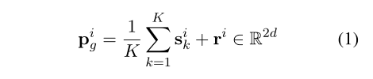
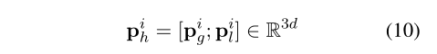
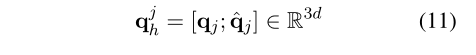

# 原型网络的发展历程

[toc]

## 方法对比

对于小样本方法的研究，现在有三种方法：元学习，原型网络，提示学习。现在主要的方法主要是元学习和原型网络，这里选用的也就是原型网络的方法。

在`<<Prototypical Networks for Few-shot Learning>>`中第一次提出了利用原型网络的方法来处理小样本学习。并给出了理论分析，一些简单的设计决策可以比元学习以及复杂架构选择的方法产生实质性的改进。而且还把原型网络推广到`zero-shot learning`，并且取得了一定的成果，具体详情，请看下面分析。

`Exploring Task Difficulty for Few-Shot Relation Extraction`提出了一个基于对比学习的混合对比关系原型（HCRP），主要关注于细粒度的小样本关系抽取，更加关注于关系相似的语句分类问题。主要看下面的分析。

### Prototypical Networks for Few-shot Learning

解决问题：通过解决过拟合的关键问题来解决小样本的问题。

提出一个假设：存在一个嵌入，其中点围绕每个类的原型表示聚集。在这个前提下，可以使用神经网络来学习输入到嵌入空间的非线性映射，并将类的原型作为嵌入空间中其支持集的平均值。分类就是看离那个原型的距离最近。

此外，还证明了当使用布雷格曼散数（平方欧几里得距离）计算距离时，使用类均值作为原型是合理的。

经验上发现欧几里得距离远远优于更常用的余弦相似度。

**训练的时候使用情景训练来训练这些网络，还展示了如果仔细考虑所选的距离度量和修改情景学习过程来大大提高性能。**

### Exploring Task Difficulty for Few-Shot Relation Extraction

该论文提出了一种新的混合对比关系原型方法（HCRP），主要为了提高硬FSRE任务的性能。具体方法就是提出了一个混合原型网络，能够捕获全局和局部特征以生成信息类原型。接下来提出一个新的关系原型对比学习方法，该方法利用关系描述作为锚，将同一类的原型在表示空间中拉近，将不同类的原型推开。这样模型就可以获得多样且有区别的原型表示。这可能对于细粒度的小样本关系抽取有帮助。最后还设计了一种基于焦点丢失的任务自适应训练策略，以从硬任务中学习更多，该策略根据任务难度为不同任务分配动态权重。

混合原型学习模块通过捕捉全局和局部特征来生成丰富的原型，从而更好地捕捉关系的细微差异。使用原型对比学习组件来利用关系标签信息来进一步增强原型表示的辨别能力。最后，引入了任务自适应焦点丢失，来鼓励模型将训练放在硬任务上。

#### 混合原型学习

TODO:原型加入全局信息和局部信息要找一下起源。

全局原型表示：模型嵌入用的是BERT来进行emmbeding，全局模型由两部分组成，一部分是[cls]的标记的隐藏状态，另一部分就是根据Snell等人的工作对k个支持实例的全局特征进行平均，就是支持集的平均TODO：很不理解，为啥[cls]和平均不太一样，整个可以相加，但是不知道为什么相加。当然为什么没有说，有的全局信息加入是加的全局关系图，是另一篇论文，下面会进行讲解。加入全局变量的目的：为了更好的进行泛化，更好地识别其他的新类。

全局原型表示：分为两个部分，而且都是有BERT来进行嵌入的，第一个是全局特征的支持集和查询集来说就是通过连接提到的两个实体的开始标记相对应的隐藏状态而获得的。关系的全局特征通过对应的[CLS]标记的隐藏状态（变换成2d维），对于每个关系i，通过利用原型网络论文中的对k个支持实例的全局特征进行平均。然后加上关系的全局特征形成全局的原型表示。

全局特征的缺点：全局特征可以捕获一般的数据表示，但是不容易捕获特定的RSRE任务中的有用本地信息。为了处理更细粒度的FSRE任务，进一步提出了本地原型，以突出实例中对表征不同关系的重要标记。

局部信息：全局原型能够捕获一般的数据表示，但是这种表示可能不容易捕获特定RSRE任务中的有用本地信息。为了更好地处理高度相似关系之间存在细微差异的硬FSRE任务，进一步提出了本地原型。目的就是为了更好的处理细粒度任务。

局部特征表示：对于关系i，首先计算第k个支持实例的局部特征

$[.]_n$是矩阵的第n行，sum()是对矩阵每行的所有元素求和运算。具体来说，就是通过根据不同的token(分词)和关系描述的相似性将权重分配给它们，然后加权和来形成这些局部特征。

类似地，计算关系嵌入$R^i$和关系i的每个支持实例嵌入之间相似性，并获得k个特征

对于k个特征进行平均，以获得关系i的最终局部表示：

查询实例的本地特征由下面的公式计算：

最后，通过平均支持集的局部特征加上关系的局部特征来生成局部原型

对于全局关系和局部关系的总结：全局关系为了更好的进行泛化，让模型具有普遍特征，局部信息有让每个类拥有更好的特征，区别于其他的关系类的特征。

混合原型：

拼接原型，把全局原型和局部原型拼接起来

通过表示查询和N个关系的原型，模型计算查询实例$q_j$的关系概率是

关系原型的对比学习：

硬任务通常涉及原型表示接近的相似关系，从而增加了对查询实例进行分类的挑战。为了更具辨别力的原型表示，提出一个关系原型的对比学习。

提出一个RPCL的方法，该方法利用可解释的关系名称和描述来校准原型，就是利用关系（关系名称和描述作为锚）与传统的无监督和自我监督对比学习不同，PRCL利用每个任务中支持实例的标签来执行监督对比学习。

具体来说，以关系表示为锚，同一类的原型为正，不同类的原型为负，RPCL旨在将正与锚拉近，将负推开，对于将混合表示的特征关系i（TODO：还有一个相关论文，至把关系作为对比学习的正负，CP方法来说就是用不同关系作为对比学习的正负）原型来说就是关系类

该模型收集了正原型和负原型，目标是区分积极和消极。使用点积来测量关系锚和选定原型之间的相似性。

对比度损失通过公式计算：

自适应焦点丢失：这个还没有搞明白

